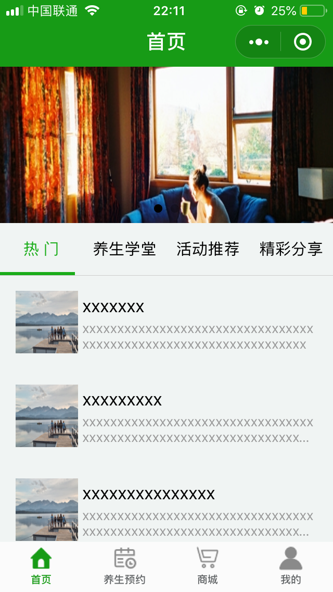
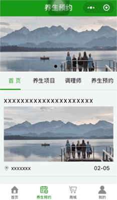
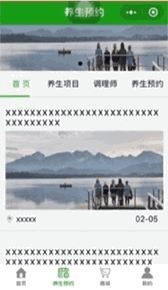

# weapp-wechat

微信小程序demo



### description
- 界面及交互设计来自知乎 Android 版本
- _工具_: [微信 web 开发者工具](https://mp.weixin.qq.com/debug/wxadoc/dev/devtools/download.html?t=1477579747265)
- _数据_: 没有开放 API, 所以使用伪造本地数据

#### 功能及使用的组件等
* 列表式渲染数据
* 自定义顶部 tabbar
* 下拉刷新
* 上拉加载更多
* 轮播图
* 自定义组件化和组件之间的通讯
<br/>等...

### Setup

```
https://github.com/TsangTszKin/WeChatApplet.git
```
下载安装Wechat DEV Tools, 并导入项目

### 演示

下拉刷新等


底部 tab 切换


顶部自定义 tab 切换



页面跳转




##### Demo 用于学习交流, 转载请注明出处


